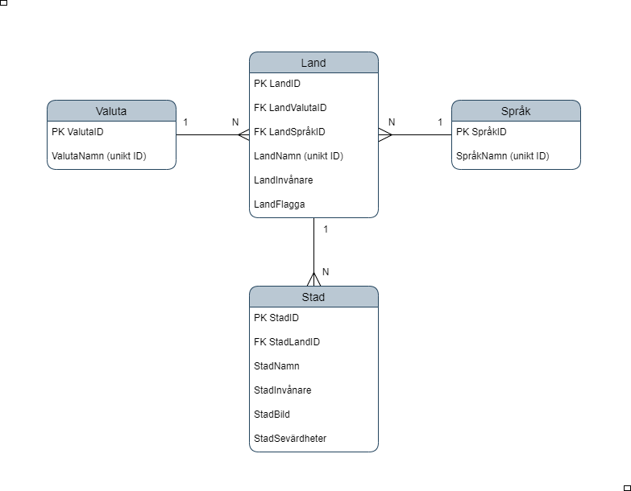

#### May 2024

#### The development team behind Country Blog: Manouella Papadopoulos, Vigan Kumnova and Ursula Vallejo.

##### IT Högskola

---

### Link to Travel Blog Project - Git:

## [GitHub Travel Blog](https://github.com/Ursulavallejo/CountryBlog)

## ER Diagram:

[](ER-diagram)

The project started by selecting a topic and drafting an ER diagram outlining the structure of a travel blog. This blog would allow users to view information about different cities and leave comments to share experiences about places they’ve visited. We used MySQL to create relationships between tables and Mongoose to manage forms in the MongoDB database.

## Wireframes:

To better visualize the project, I created wireframes using Figma. These wireframes served as a guide for the development of the user interface and were refined with feedback from the team.

[](WireframeHome)
[](WireframeAllComments)
[](WireframeOne_Country_comments)

## ENDPOINTS AND PROJECT RELATIONS

I developed the backend component related to the countries table. I created two endpoints to access information: one to retrieve all country-related data, and another to retrieve information based on a specific city ID.

```javascript
// SQL endpoint that relates info between all tables
router.get('/api/country-city-info', countryController.getAllInfoCountryCity)

router.get(
  '/api/country-city-info/:id',
  countryController.getCountryCityInfoById
)
```

In the controller, I used SQL INNER JOINS to fetch the necessary data and then processed it in the frontend.

- Backend / CountryControllers.js

All Info:

```javascript
exports.getAllInfoCountryCity = async (req, res) => {
  let sql =
    'SELECT  city.cityId AS CityId,city.cityName AS City, country.countryName AS Country, country.countryId AS CountryId,  language.languageName AS Language, currency.currencyName AS Currency, country.countryPopulation AS Population, country.countryFlag AS FlagImage, city.cityImage AS CityImage, city.cityAttraction AS CityAttraction FROM city JOIN country ON city.cityCountryId = country.countryId JOIN language ON country.countryLanguageId = language.languageId JOIN currency ON country.countryCurrencyId = currency.currencyId;'
}
```

Info by ID:

This works by retrieving information based on the city ID and displaying it in the frontend depending on the selected city from the dropdown (the dropdown emits the city ID to `CountryCityDropOne.vue`, which I created). I wanted the frontend to access this info by sending its ID via fetch and then displaying it in the DOM.

```javascript
exports.getCountryCityInfoById = async (req, res) => {
  const cityId = req.params.id

  let sql = `
  SELECT  city.cityId AS CityId,city.cityName AS City,
           country.countryName AS Country,
           country.countryId AS CountryId,
           language.languageName AS Language,
           currency.currencyName AS Currency,
           country.countryPopulation AS Population,
           country.countryFlag AS FlagImage,
           city.cityImage AS CityImage,
           city.cityAttraction AS CityAttraction
    FROM city
    JOIN country ON city.cityCountryId = country.countryId
    JOIN language ON country.countryLanguageId = language.languageId
    JOIN currency ON country.countryCurrencyId = currency.currencyId
    WHERE city.cityId = ?;
  `
}
```

### FETCH API – Frontend:

```javascript
fetch('http://localhost:3000/api/country-city-info')
  .then((response) => response.json())
  .then((countriesCities) => {
    this.countriesCities = countriesCities
    console.log(countriesCities)
  })
```

```javascript
 fetchCityInfo(selectedCityId) {
      fetch(`http://localhost:3000/api/country-city-info/${selectedCityId}`)
        .then((response) => response.json())
        .then((cityInfo) => {
          this.cityInfo = cityInfo
        })
        .catch((error) => {
          console.error('Error fetching city info:', error)
        })
    },
```

## Mongoose

This part was done collaboratively in the backend. On the frontend, I was responsible for creating the component to render all comments in the DOM, as well as the card component related to each comment.

**CardComments.vue:**

```javascript
<script>
export default {
  props: [
    'country',
    'date',
    'title',
    'comment',
    'userName',
    'homeCountry',
    'flagImage',
  ],
  data() {
    return {
      allCountries: null,
    }
  },
  methods: {
    formatDate(dateString) {
      const date = new Date(dateString)
      return date.toISOString().split('T')[0]
    },
  },
}
</script>
```

**AllComments.vue:**

```javascript
<script>
import CardComments from './CardComments.vue'

export default {
  components: {
    CardComments,
  },
  created() {
    this.fetchComments()
  },
  data() {
    return {
      comments: null,
    }
  },
  methods: {
    fetchComments() {
      fetch('http://localhost:3000/api/comment')
        .then((response) => response.json())
        .then((comments) => {
          this.comments = comments.reverse()

          fetch('http://localhost:3000/api/countries')
            .then((response) => response.json())
            .then((countries) => {
              for (let i = 0; i < this.comments.length; i++) {
                for (let j = 0; j < countries.length; j++) {
                  if (this.comments[i].country === countries[j].countryName) {
                    this.comments[i].flagImage = countries[j].countryFlag
                  }
                }
              }
            })
        })
    },
  },
}
</script>
```

---

## Suggested Enhancements for the Country Section

To improve the user experience and provide more in-depth information for users planning trips, I propose integrating a new table with extended country details, such as:

- **Geographic Coordinates** (latitude/longitude)
- **Continent**
- **Timezone**
- **Climate**
- **Popular Tourist Attractions**

### Frontend Integration

We could display this data in a “Country Info” section for each country, giving users a richer understanding of their destination.

---

## General Feature Suggestions

With more time, we could have improved functionality and UX by adding:

1. **Likes and Reviews on Comments**
   Let users like helpful comments or leave follow-up feedback.

2. **Advanced Filtering for Comments**
   Enable filtering by country, likes, or date.

3. **Improved Form Validation**
   Provide clearer messages and limit text properly.

4. **Admin Login and Dashboard**
   Admins could manage content, add/edit/remove countries or data.

---

This report summarizes my contributions to the project, focusing on backend and frontend implementation, as well as design decisions and suggestions for future improvements.
