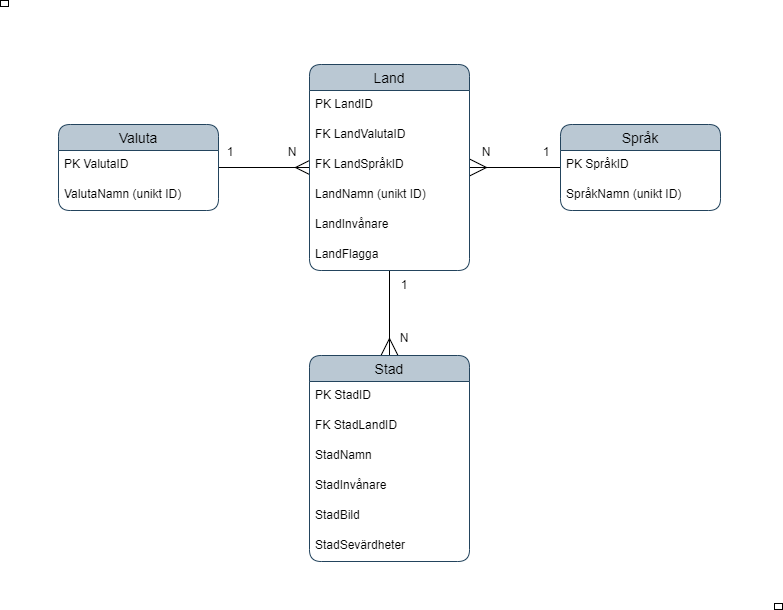

# TRAVEL BLOG : LABB3 Backendprogrammering

## IT Högskola

[](ER-Diagram)

```javascript
// SQL endpoint that relate info between all tables
router.get('/api/country-city-info', countryController.getAllInfoCountryCity)

router.get(
  '/api/country-city-info/:id',
  countryController.getCountryCityInfoById
)
```
