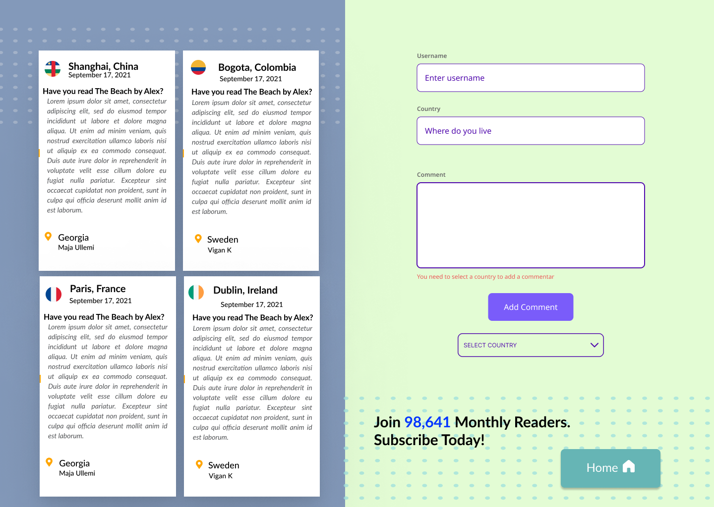
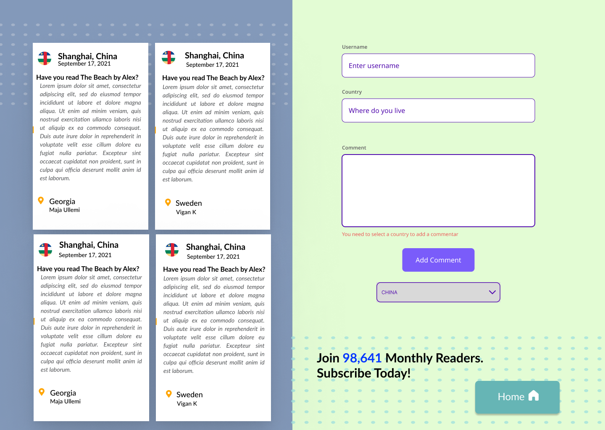

#### May 2024

> The development team behind 🌍 COUNTRY BLOG:
> Manouella Papadopoulos, Vigan Kumnova and Ursula Vallejo.

**Project Summary**

Country Blog is a full-stack application developed as part of the Backend Programming (LABB 3) course at IT-Högskolan. The goal of the project was to create an interactive blog where users can explore countries and cities, view detailed travel information, and read or submit comments based on their experiences.

The backend is built with MySQL and MongoDB (via Mongoose) to manage structured data (countries, cities, languages, currencies) and user-generated content (comments). The frontend, built with Vue.js, allows users to:

🔎 Browse cities and filter by country

💬 Read and post comments

🌐 View extended data such as language, currency, population, attractions, and flags

🎯 Fetch dynamic data via RESTful API endpoints (GET by ID, full joins, etc.)

The project includes structured endpoints, reusable components, and a responsive UI based on custom wireframes created in Figma.

Main features implemented:

- Country-city relationship with JOINs (SQL)
- City-specific views fetched by ID
- Comment system stored in MongoDB
- Flags dynamically matched to countries
- Suggestions for scalability and admin features

✨ Developed collaboratively in a team, with individual contributions clearly defined.


https://github.com/user-attachments/assets/202d7634-e3b2-45ca-9b85-d01e05f9be21


---

### General view:

[](WireframeHome)
[](WireframeAllComments)
[](WireframeOne_Country_comments)

---

### 🔧 Installation and Usage

1.  **Clone or download** the project folder

    ```bash
    git clone <your-repo-url>
    cd <project-folder>
    ```

2.  **Install Dependencies**

    ```bash
    npm install
    ```

3.  **Run in Development Mode**

    ```bash
    npm run dev
    ```

    - The app will be available at `http://localhost:5173` (or the port shown by Vite).
    - Enter your name on load and start exploring the app.

---

### 📄 [Detailed Information of the Project](Detail_Info.md)
